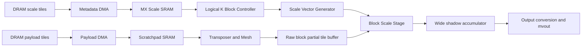
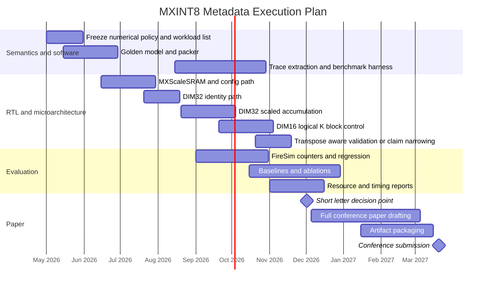

# Critical Review of the MXINT8 Gemmini Research Plan

## Executive summary

Bluntly: the uploaded LaTeX plan is a **good internal architecture memo** and **not yet a strong paper plan**. The core idea is real, but the current framing is too close to “we added MXINT8 to Gemmini,” which is not enough. The publishable version is narrower and sharper: **metadata-aware execution of block-scaled numerics on transposer-based systolic arrays when logical MX blocks do not align with physical array width**. If you frame it that way, formalize the semantics, add real baselines, and produce convincing DIM=16 evidence with reproducible FPGA/full-stack evaluation, this can become a solid conference paper and a credible journal seed.

| Dimension | Verdict | What must change |
|---|---|---|
| Technical direction | **Strong** | Keep MXINT8 as the implementation vehicle, but sell the paper as a metadata-execution problem, not a datatype port |
| Current publishability | **Not yet** | Add formal problem statement, stronger baselines, concrete workloads, area/timing evidence, artifact discipline |
| ASIC relevance | **High** | Tie the story explicitly to current block-scaled / microscaling hardware and software stacks |
| FPGA relevance | **Moderate** | Position it as forward-looking architecture work; avoid pretending native MX is already mainstream in FPGA product flows |
| Feasibility for two PhDs in one year | **Yes, if tightly scoped** | Design freeze by month 1, DIM=32 by month 4, DIM=16 by month 6, no uncontrolled expansion into MXFP8 or full training |

The industry relevance is not speculative. entity["organization","Open Compute Project","open hardware consortium"] standardized MX-compliant formats, including MX INT8, and the spec explicitly positions MX as a low-friction, energy-efficiency-oriented alternative for training and inference. entity["company","NVIDIA","gpu company"] Blackwell Tensor Cores and Transformer Engine now expose community-defined microscaling formats, and current cuDNN backend release notes include MXFP8 support for Blackwell attention and MoE grouped matmuls. entity["company","AMD","chip company"] is also advertising MXFP4/MXFP6 support in Instinct MI350 and documents MX quantization in Quark. entity["company","Intel","chip company"], by contrast, still publicly emphasizes BF16/FP16-style hardened DSP support in Agilex materials rather than native MX-style formats. That means the **ASIC story is immediate**, while the **FPGA story is strategically relevant but less product-proximate**. citeturn10view3turn10view12turn10view13turn10view6turn19view0turn19view1turn10view7turn10view11

My recommendation is simple: **conference first, journal second**. If the DIM=16 result is strong and reproducible, target an FPGA/reconfigurable-systems venue first; if the results are thinner, cut to a short architecture letter rather than overclaiming. The journal version should follow only after broader dataflow support, stronger synthesis evidence, and a more general metadata-execution argument.

## What the uploaded plan already says

The uploaded plan already contains a lot of useful structure. The problem is not lack of effort; it is that some of the most important paper-grade elements are implied rather than nailed down.

| Extracted element | What the LaTeX plan contains | My assessment |
|---|---|---|
| Core claim | Microscaling is not plug-and-play for transposer-based systolic arrays; metadata must be tracked by logical 32-element K-blocks rather than physical rows or transposer cycles | Good and potentially publishable, but it needs formal semantics and better baselines |
| Main objective | Add MXINT8 metadata-aware execution to Gemmini, with a sidecar metadata memory, logical K-block controller, and block-scale application stage | Good objective; must be framed as a general architecture mechanism rather than an implementation patch |
| Research scope | MXINT8 only; not MXFP8/4 or a whole family of datatypes | Correct decision for year 1 |
| Staging | Stage A with DIM=32 aligned MVP, then Stage B with DIM=16 as the actual research contribution | Exactly right; keep it |
| Method | MXScaleSRAM, MXKBlockController, ScaleVectorGenerator, BlockScaleUnit, software packer, reference GEMM, baremetal tests, FireSim evaluation | Strong components, but still under-specified at the theorem, baseline, and critical-path levels |
| Quantization policy | Symmetric block quantization with power-of-two shared scale; several choices listed for rounding/range/overflow/tails | Useful start, but the paper cannot proceed without freezing one policy |
| Experiments | Layered validation, microbenchmarks, K sweeps, shape sweeps, one MLP-heavy workload, one transformer-like kernel sequence, baseline vs proposed design | Too vague; the final paper needs named workload sets and explicit inclusion/exclusion rules |
| Datasets | Not concretely specified beyond categories | Major weakness |
| Metrics | Cycles, useful MACs, payload/metadata bytes, metadata stalls, K-block count, transposer active cycles, BSU activity, resource usage | Good architecture metrics; missing model-level accuracy sanity and clearer normalization rules |
| Timeline | Month-by-month two-person plan, with stop/go criteria by month 6 | Good skeleton; I would tighten the exit criteria and owners |
| Deliverables | Policy file, golden model, Gemmini patch, tests, FireSim configs, CSV logs, reports, scripts | Good and artifact-friendly |
| Risks | Accumulator semantics, invasive DIM=16 control, transposer scope explosion, FireSim version drift, weak reviewer framing, benchmark sprawl | Accurate risk register |
| Missing details | Exact numerical contract, supported dataflows in final claim set, concrete datasets, baseline definitions, synthesis methodology, publishability thresholds | These are the gaps that currently keep the plan below conference quality |

The strongest parts of the uploaded plan are the scope discipline, the DIM=32 to DIM=16 sequencing, and the insistence that MX metadata should **not** be treated as ordinary payload. The weakest parts are the missing formalization, the under-specified baselines, and the lack of a concrete benchmark package.

## Publishability and industry relevance

There is a real paper here, but only if you stop selling it as “MXINT8 in Gemmini.” That title would undersell the problem and make the whole project look like infrastructure plumbing. The publishable thesis is this:

**A systolic array whose physical inner dimension does not match the logical block-scaled reduction domain needs an explicit metadata-execution mechanism.**

That thesis survives beyond Gemmini, beyond MXINT8, and beyond one array dimension. The reason that framing matters is that vendor momentum is now clearly behind **block-scaled formats and microscaling**, even if the highest-visibility product support today is mostly on the floating side rather than MXINT8 specifically. OCP standardized the MX family; Blackwell advertises community-defined microscaling formats; Transformer Engine documents Blackwell support for MXFP8 and NVFP4; cuDNN release notes now call out MXFP8 support in real kernels; AMD markets MXFP4/MXFP6 in current Instinct GPUs and documents MX quantization software flows. That is enough evidence that the problem class is current. citeturn10view3turn10view12turn10view13turn10view6turn19view0turn19view1turn10view7

image_group{"layout":"carousel","aspect_ratio":"16:9","query":["NVIDIA Blackwell Tensor Cores official", "AMD Instinct MI350 official", "AMD Versal AI Edge Gen 2 official", "Intel Agilex FPGA official"], "num_per_query": 1}

The ASIC side is therefore straightforward: **yes, this topic is relevant right now**. The FPGA side needs a more honest answer. AMD’s current Vitis AI documentation for Adaptive SoCs and FPGAs still centers practical deployment around INT8, BF16, and mixed precision, and Intel’s published Agilex messaging emphasizes BF16/FP16-capable DSP infrastructure. That means your MXINT8 Gemmini work is **not** directly aligned with the mainstream vendor FPGA software flow today. It is relevant as a **research path for next-generation low-precision FPGA/ASIC datapaths**, not as a drop-in answer to a widely deployed FPGA product stack. You should say that plainly in the paper instead of overselling immediate FPGA adoption. citeturn10view8turn10view9turn10view10turn19view2turn10view11

There is also a hard competitive reality. Reviewers will read your paper against prior flexible-precision and block-scaled work such as **Flexpoint**, **HBFP**, **BitFusion**, **Eyeriss**, and recent MX/BFP accelerator papers like **MicroScopiQ**, **BBAL**, **M²XFP**, and recent precision-scalable MX processing work. Some of those papers already report multi-x speedups, lower energy, reduced memory footprint, or meaningful area reductions. So if your message is only “we integrated MXINT8 into Gemmini,” reviewers will treat it as incremental. If the message is “we formalized and solved metadata execution under logical/physical mismatch, validated it in a full-stack accelerator generator, and quantified the control-path and layout consequences,” then the contribution becomes much more defensible. citeturn7search0turn7search1turn12search0turn12search1turn17view0turn17view2turn16search13turn17view3

My bottom-line industry verdict is this:

- **Relevant to current ASIC practice:** yes.
- **Relevant to current FPGA research:** yes.
- **Relevant to current mainstream FPGA deployment flows:** only partially.
- **Publishable:** yes, if reframed and tightened.
- **Top-tier architecture publishable:** not with the current draft; maybe with much stronger generalization and evaluation.
- **Strong IEEE-style conference paper:** absolutely possible.

## Critical weaknesses

Here are the parts that will hurt you in review if you do not fix them.

| Weakness | Why it will hurt | Required fix |
|---|---|---|
| The claim is too implementation-centric | “Added MXINT8 to Gemmini” sounds like engineering, not architecture | Reframe around metadata execution under logical/physical block mismatch |
| No formal problem statement | The paper currently has intuition, not a crisp proof obligation | Define the mapping from physical K episodes to logical 32-element MX blocks and state the correctness invariant explicitly |
| Accumulator semantics are still hand-wavy | This is the most failure-prone numerical point for K>32 | Freeze exponent-alignment policy and choose a wide shadow accumulator |
| The transposer claim currently overshoots the verified scope | A reviewer will ask whether this is truly about transposer-based arrays or just a WS-only patch | Either validate at least one OS/transposer case or narrow the claim in the final paper |
| Baselines are weak or implicit | Bad baselines kill architecture papers | Add duplicate-transposed-storage, software-repack, stock INT8, aligned DIM=32, and oracle/no-stall baselines |
| Workloads are unspecified | “One MLP-heavy workload” is not a benchmark plan | Name concrete model/dataset or trace sources |
| No model-level sanity for numerical behavior | Even if this is an architecture paper, reviewers will not trust a datatype-enabled system with zero accuracy sanity | Add software-only accuracy deltas on at least one CNN and one transformer-derived workload |
| No area/timing methodology | Throughput-only evaluation is not enough | Require FPGA resource/Fmax reports and, if available, at least one ASIC-style relative synthesis pass |
| Reproducibility is underdeveloped | Full-stack papers die on environment drift | Freeze commits, containers, seeds, scripts, traces, and artifact layout early |
| Architecture critical-path risk is understated | A per-element scale/shift stage on the hot path can destroy Fmax | Move exponent decode off the hot path and strongly consider tile-buffered scale application |

The sharpest logical mismatch in the current plan is the transposer story. Gemmini’s public documentation makes clear that the transposer is part of `MeshWithDelays`, that Gemmini supports both WS and OS dataflows, and that the transposer is used even when the programmer does not explicitly request transposition for OS matmuls. That means a **WS-only MVP is fine**, but a **final paper whose headline contribution is “transposer-based systolic arrays” must either validate OS behavior or narrow the claim**. Do not leave that ambiguous. citeturn21view0turn21view1turn21view2turn21view3

The second sharp weakness is numerical rigor. For one logical MX block of 32 signed int8 values, the worst-case raw inner product bound is

\[
|P^{(b)}_{ij}| \le 32 \cdot 127^2 = 516{,}128,
\]

so the **raw per-block partial** fits comfortably in signed int32. The trouble begins only after exponent alignment and cross-block accumulation. That is exactly why the current plan’s “we may keep int32 if dynamic range is limited” is not good enough. You need a named policy and a width decision. My recommendation is a **48-bit or 64-bit shadow tile accumulator** internally, even if the external accumulator interface remains int32 for compatibility.

There is also a message problem. The raw metadata volume is modest: one scale byte per 32 payload values is only **3.125% extra bytes per operand block**. So if the paper argues mainly about metadata storage overhead, reviewers will shrug. The real contribution is not that metadata exists; it is that **misaligned metadata causes wrong accumulation order, transposer/layout complications, duplicate storage pressure, and control-path stalls**. That is the paper.

## Revised technical plan

The formal problem statement should be the anchor of the paper.

Let the MX block size be \(B=32\), as specified by the MX standard, and let the physical systolic-array inner dimension be \(d \in \{16, 32\}\). Let the payload tensors be quantized blockwise with shared exponents:

\[
\hat C_{ij} = \sum_{b=0}^{\lceil K/B \rceil - 1}
2^{e^A_{i,b}+e^B_{b,j}}
\sum_{t=0}^{B-1}
\hat a_{i,b,t}\hat b_{b,t,j}.
\]

For a physical execution sliced into episodes of width \(d\), define the logical K-block index as

\[
\beta(t) = \left\lfloor \frac{t}{B} \right\rfloor.
\]

The required hardware correctness invariant is:

\[
\forall t_1, t_2 \text{ within the same logical block } b,\;
\beta(t_1)=\beta(t_2)=b \Rightarrow
\mu_A(i,t_1)=\mu_A(i,t_2),\;
\mu_B(j,t_1)=\mu_B(j,t_2),
\]

and the scale product for block \(b\) must be applied **once per logical block before** that block’s contribution is merged with a different logical block’s contribution. This follows directly from MX block semantics and becomes nontrivial once the physical episode width differs from 32 or the operand view is transposed. citeturn10view3turn21view0turn21view3

The three hypotheses worth publishing are these:

\[
H_1:\ \text{Sidecar metadata execution reduces metadata-related traffic/stalls versus duplicate or repack baselines.}
\]

\[
H_2:\ \text{Logical K-block tracking preserves exact MXINT8 semantics for } d=16 \text{ with acceptable cost.}
\]

\[
H_3:\ \text{The benefit persists on realistic GEMM traces, not only on toy square matrices.}
\]

For this to be a real paper, I would insist on the following empirical thresholds:

- **Correctness:** zero invariant violations and exact match to the golden model on deterministic tests.
- **Resource discipline:** less than roughly **10–15% Fmax loss** and a bounded LUT/BRAM increase versus stock DIM-matched Gemmini.
- **Performance relevance:** at least one meaningful win over a non-strawman metadata baseline on realistic traces. If your gains are under 10% everywhere, the paper becomes fragile.
- **Conference-grade maturity:** DIM=16 results, not just DIM=32.

The architecture should be revised slightly from the uploaded plan. In particular, do **not** put full exponent decode and arbitrary per-element shift logic directly on the hottest path if you can avoid it. Predecode E8M0 metadata to signed exponents at metadata ingest, store the exponent form in the sidecar SRAM, and strongly consider a **two-step tile-buffered scaling path**:

1. mesh computes raw block partial tile;
2. temporary tile buffer stores raw int32 outputs for one logical block;
3. block-scale stage aligns them to a tile exponent policy;
4. wide accumulator merges them with prior logical blocks.

That is less elegant on paper than a pure stream, but much more likely to close timing.

The design rules I would freeze immediately are below.

| Design decision | Recommended choice | Why |
|---|---|---|
| Numerical policy | Nearest-even, saturating arithmetic, finite scale bytes only in year 1 | You need one unambiguous reference model |
| Supported mode in MVP | GEMM only, WS first | Necessary for schedule control |
| Supported mode in final conference paper | WS plus at least one validated OS/transposer case, or else narrow the claim | Otherwise the paper overclaims |
| Internal accumulator | 48-bit or 64-bit shadow accumulator | Avoid numerical embarrassment for K>32 |
| Metadata representation | Store exponents in sidecar SRAM after decode | Keeps decode off critical path |
| Bring-up strategy | DIM=32 first, DIM=16 second | Already the right strategy |
| Claim boundary | “metadata execution for block-scaled systolic arrays” | Stronger and more durable than “MXINT8 in Gemmini” |
| Explicitly excluded from year 1 | MXFP8, training, arbitrary-DIM generalization, full compiler automation | You do not have the bandwidth |

The baseline set also needs to be fixed now.

| Baseline | What it is | Keep it? | Why it matters |
|---|---|---|---|
| Stock Gemmini INT8 | No MX metadata, normal INT8 path | **Yes** | Latency/resource lower bound |
| DIM=32 aligned proposed | Proposed metadata engine with natural 32-lane alignment | **Yes** | Isolates the easy case |
| Duplicate-transposed metadata baseline | Software/materialized extra metadata views to avoid logical remapping | **Yes** | Real storage and movement baseline |
| Software-repack baseline | Repack metadata per operand view or transpose case | **Yes** | Realistic “do it in software” baseline |
| Proposed DIM=16 logical-K design | Main contribution | **Yes** | What the paper stands on |
| Oracle no-stall variant | Same design with metadata stall effects removed in simulation | **Yes** | Quantifies headroom |
| Inline-scale-as-payload strawman | Treat scales as normal payload through transposer | **No, not as a main baseline** | Too silly; use only as a rejected design if needed in appendix |

The benchmark and dataset plan must also be concretized. The current plan is too vague.

| Priority | Workload | Dataset or source | Why it belongs | Year-1 decision |
|---|---|---|---|---|
| Must-have | Synthetic GEMM suite | Hand-generated square, skinny, fat, and K-tail shapes | Isolates correctness, control cost, and metadata stalls | **Include** |
| Must-have | Transformer-derived trace replay | GEMM traces from BERT-Large-style attention and MLP layers | Closest match to present AI accelerator relevance | **Include** |
| Should-have | ResNet50 operator set | ImageNet-1K / MLPerf-style ResNet50 trace shapes | Gives a non-transformer sanity point | **Include if low friction** |
| Should-have | BERT-Large software-only accuracy sanity | SQuAD v1.1 | Shows MXINT8 semantics are not numerically absurd | **Include in software only** |
| Optional | GPT-J or Llama trace replay | MLPerf language benchmark shapes only, not full deployment | Adds current-language relevance without exploding scope | **Late-stage optional** |
| Reject for year 1 | Full DLRM_v2 end to end | Synthetic Multihot Criteo | Too much system complexity for too little incremental insight here | **Do not include** |
| Reject for year 1 | Full Llama2-70B on Gemmini | OpenORCA benchmark path | Completely unrealistic for this schedule | **Do not include** |

The standardized workload mix worth borrowing from entity["organization","MLCommons","ml benchmark consortium"] includes ResNet50/ImageNet, BERT-Large/SQuAD, GPT-J/CNN-DailyMail, Llama2-70B/OpenORCA, DLRM_v2, graph, speech, and other modern inference tasks, and recent MLPerf releases keep evolving the suite precisely to remain representative of current deployment realities. That makes MLPerf-derived trace families a defensible source of workload shapes without forcing you to reproduce the entire benchmark methodology on Gemmini. citeturn15view0turn23view0turn23view1

The evaluation protocol should include the following ablations and failure checks.

| Ablation or failure mode | Why it matters | Metric |
|---|---|---|
| DIM=32 vs DIM=16 | Separates plumbing from the real contribution | cycles, stalls, Fmax, exactness |
| Metadata stall path on/off | Quantifies metadata fetch pain | stall cycles, total cycles |
| Duplicate storage vs logical remap | Shows why the controller/vector logic exists | bytes moved, bytes stored, cycles |
| int32 vs int64 shadow accumulation | Exposes numerical fragility | exactness, saturation count |
| Fixed tile exponent vs dynamic tile exponent | Exposes scale policy trade-off | error, latency, logic cost |
| Transpose-aware path on/off | Validates claim scope | correctness, resource delta |
| Tail blocks | Common source of silent bugs | exactness on odd K |
| Scale decode at load time vs execute time | Critical-path sensitivity | Fmax, cycles |
| Identity-scale mode | Must collapse to stock INT8 semantics | exact equality to stock path |

The instrumentation plan in the uploaded draft is directionally right. Use FireSim’s AutoCounter flow, because it is already designed around cover-function-based, module-filtered automatic counter generation. Add counters for metadata reads, metadata stalls, logical K-block transitions, BSU invocations, and transposer activity. Do not pretend TracerV is a substitute for architecture counters. It is not. citeturn10view5turn22search0

You also asked for suggested citations. The current LaTeX file is too sparse. At minimum, the paper should cite the following groups.

| Citation group | Add these references | Why |
|---|---|---|
| Standard and implementation substrate | OCP MX specification; Gemmini paper/repo; FireSim AutoCounter docs | Defines the format, the target platform, and the measurement methodology |
| Seminal shared-exponent numerics | Flexpoint; HBFP | Shows the numerical lineage and why shared-scale formats matter |
| Flexible-precision accelerator context | BitFusion; Eyeriss | Establishes the accelerator-side prior art and reviewer baseline |
| Recent MX/BFP accelerator landscape | MicroScopiQ; recent precision-scalable MX processing work; BBAL; M²XFP | Shows that your work sits in an active and increasingly competitive research area |
| Benchmarking and reproducibility | MLPerf benchmark docs/releases | Justifies workload selection and reproducibility framing |

The recommended source set above is grounded in primary or near-primary references: OCP for the standard, Gemmini and FireSim for platform/tooling, arXiv/DOI sources for the classic and current papers, and MLPerf/MLCommons for benchmark selection. citeturn10view3turn10view4turn10view5turn7search0turn7search1turn12search0turn12search1turn17view0turn17view2turn16search13turn17view3turn15view0turn23view0

## Execution timeline and publication roadmap

The year plan is feasible, but only if the first six months are treated as a hard design phase and not as an open-ended exploration.

| Window | Primary owner | Concrete milestone | Exit criterion |
|---|---|---|---|
| May 2026 | Both | Semantics freeze | `mxint8_policy.md`, exact rounding/range/tail rules, benchmark list frozen |
| Jun 2026 | PhD A + PhD B | Golden model and metadata packer | Randomized reference tests pass on odd/even M/N/K |
| Jul 2026 | PhD A | MXScaleSRAM and load/store path | Metadata round-trip test passes |
| Aug 2026 | PhD A | DIM=32 identity-scale path | Exact match to stock INT8 at K=32 |
| Sep 2026 | PhD A + PhD B | DIM=32 scaled accumulation for K>32 | Exact match to golden model at K=64/96/128 |
| Oct 2026 | PhD A | DIM=16 logical-K controller | Two-phase hold invariant proven in tests |
| Oct 2026 | PhD B | Initial benchmark harness and baseline traces | Synthetic + transformer-derived traces reproducible |
| Nov 2026 | Both | First full evaluation cut | Baseline vs proposed plots exist; resource/Fmax reports exist |
| Dec 2026 | Both | Scope review | Decide CAL-worthy short result vs continue to full conference paper |
| Jan-Feb 2027 | Both | Mature evaluation + artifact | Reproducible scripts, CSVs, configs, commit hashes, hardware reports |
| Mar 2027 | Both | Conference submission package | Main paper, appendix, artifact draft, rebuttal notes |
| Apr 2027 | Both | Journal-extension planning | Decide whether additional OS/dataflow/synthesis work merits journal version |

Here is the execution plan I would actually run.

The resource plan should also be made explicit.

| Resource | Minimum realistic allocation |
|---|---|
| People | Two PhDs at roughly 0.8 FTE each on this project for one year |
| Compute | One shared 32–64 core build server with 128–256 GB RAM |
| FPGA/full-system infra | One on-prem FireSim-supported board path such as VCU118 or U280, plus Vivado build access |
| Software support | One GPU workstation is helpful, but only for trace extraction and software quantization sanity, not for the core hardware evaluation |
| Storage | 1–2 TB for builds, traces, waveforms, CSVs, and artifacts |
| Cadence | Nightly software/RTL regression, weekly FireSim/perf run, biweekly resource/timing review |

Current FireSim documentation explicitly recommends on-premises FPGA flows as the practical path now that AWS F1 support is being phased out, and it lists VCU118/U280-style XDMA-based flows as fully supported. Plan infrastructure accordingly instead of assuming old cloud-FPGA shortcuts. citeturn22search9turn22search0turn22search3

For the publication path, I would not overcomplicate this.

If the work matures into a strong DIM=16 result with meaningful baseline wins, reproducible artifact packaging, and credible FPGA resource/timing evidence, the best-fit primary venue is an IEEE-style reconfigurable-systems conference such as FCCM. FCCM explicitly positions itself as a premier forum for architectures, tools, and programming models for reconfigurable/custom computing machines, and it already runs an artifact-evaluation process that is highly compatible with your full-stack Gemmini/FireSim story. If the results are earlier-stage but still clean and high-impact, a short architecture letter is the right fallback; the current call for papers for CAL is ongoing and explicitly welcomes reconfigurable systems and architecture-performance evaluation work. entity["organization","IEEE","engineering society"] and entity["organization","ACM","computing society"] venue culture will reward rigor more than ambition theater here. citeturn10view14turn23view2turn10view15

My concrete roadmap is:

- **Month 8 decision point:** if you only have DIM=32 plus partial DIM=16, write a short letter only if the core insight is already crisp.
- **Main conference target:** FCCM 2027 cycle if DIM=16 works and the artifact is real.
- **Journal extension afterward:** only after adding broader dataflow support, stronger synthesis evidence, and expanded workloads. Good journal candidates are VLSI/CAD-style venues, but only once the work is clearly more than a conference appendix.

Do **not** start with the journal. That is the wrong ordering for this project.

## One-page checklist

**Use this literally as the shared execution checklist for the two PhDs.**

### Before any more RTL

- [ ] Freeze one exact numerical contract: payload range, rounding, saturation, zero-block rule, tail-block rule.
- [ ] Freeze one exact paper claim.
- [ ] Freeze workload list and explicit exclusions.
- [ ] Freeze repository commits, tool versions, and container environment.
- [ ] Write the formal correctness invariant for logical vs physical K-block execution.

### Hardware must-haves

- [ ] Sidecar metadata SRAM with counters.
- [ ] Logical K-block controller with explicit DIM=16 hold invariant.
- [ ] Exponent decode moved off the hot path.
- [ ] Wide shadow accumulator selected and documented.
- [ ] Identity-scale mode collapses exactly to stock INT8 behavior.
- [ ] Tail masking formally tested.
- [ ] At least one transpose-aware or OS-related validation case exists, or the claim is narrowed before submission.

### Software and validation must-haves

- [ ] Golden model is bit-exact for the frozen contract.
- [ ] Randomized differential tests cover odd M/N/K, tails, sign extremes, and random exponents.
- [ ] Trace extractor produces deterministic workloads from named models.
- [ ] Result checker distinguishes exact-equality tests from tolerance-based tests.
- [ ] Benchmark scripts emit machine-readable CSV and config metadata.

### Evaluation must-haves

- [ ] Stock INT8 baseline.
- [ ] Software-repack baseline.
- [ ] Duplicate-transposed metadata baseline.
- [ ] DIM=32 proposed baseline.
- [ ] DIM=16 proposed design.
- [ ] Oracle no-stall comparison.
- [ ] Resource and Fmax reports.
- [ ] Metadata bytes, metadata stalls, transposer activity, and total cycles all reported.

### Paper must-haves

- [ ] Problem statement written mathematically on page 1.
- [ ] One architecture figure and one timeline figure.
- [ ] One table for datasets/workloads, one for baselines, one for milestones.
- [ ] One paragraph explicitly stating what is **not** supported.
- [ ] Suggested citations expanded far beyond the current draft.
- [ ] Reproducibility appendix prepared before submission, not after acceptance.

### Stop criteria

- [ ] If semantics are still unsettled after month 1, stop RTL and fix semantics.
- [ ] If DIM=32 is not correct by month 4, cut scope immediately.
- [ ] If DIM=16 shows no convincing benefit over software/duplicate baselines by month 6, downgrade the venue ambition.
- [ ] If OS/transposer validation never materializes, narrow the claim before reviewers do it for you.

The bottom line is simple: **keep the topic, change the paper.** The topic is timely and industry-relevant. The current draft is not yet strong enough as a publication plan. With the fixes above, two good PhD researchers can finish the design in six months and produce a credible conference submission within a year.